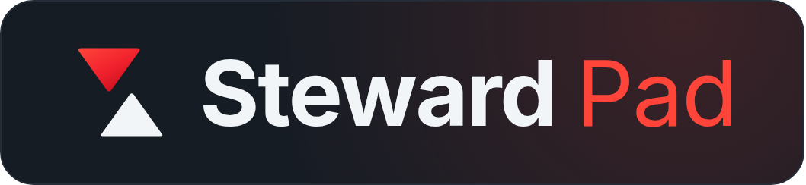
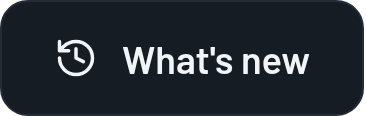
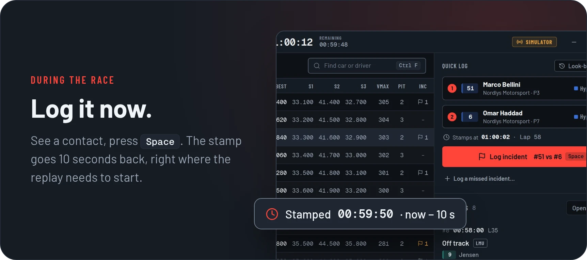
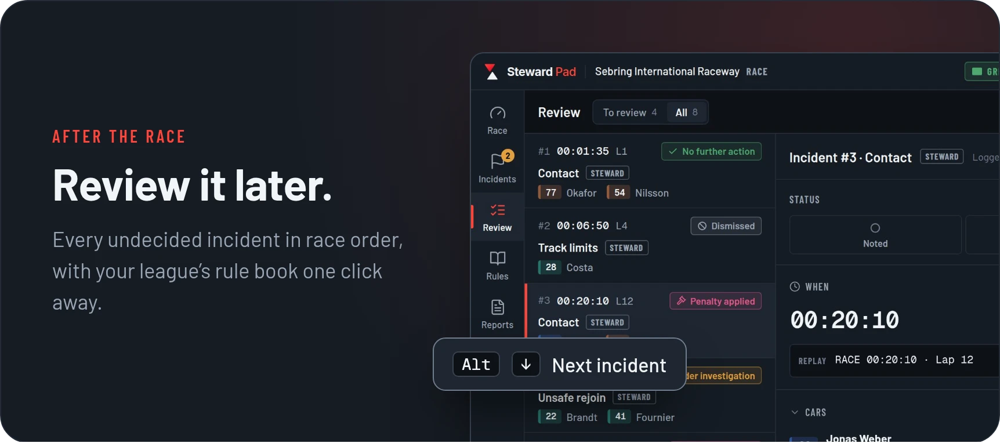
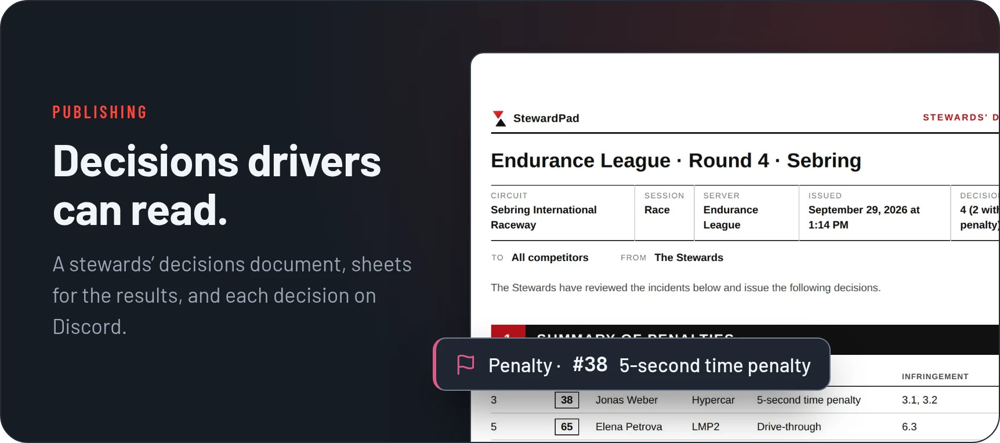
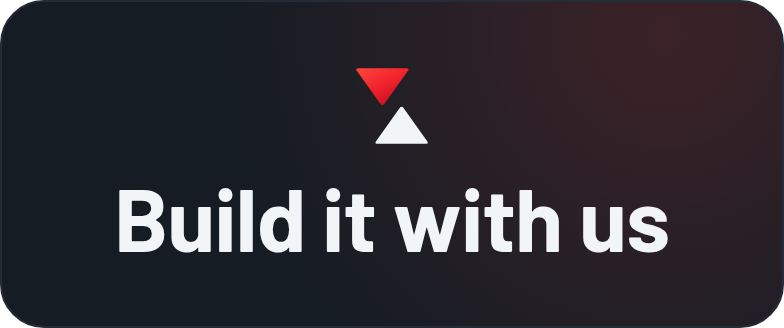
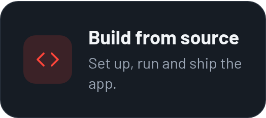
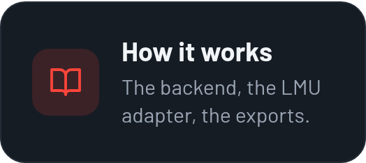
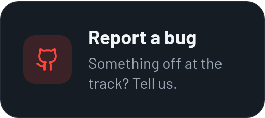

  

  Free and open source race control for <b>Le Mans Ultimate</b> league stewards. 
  Log incidents at one keypress, review them against the replay, publish decisions drivers can read.

  
  

#

 

  

  

  

#

 

  

  <b>Want to make StewardPad better? You're in the right place.</b> 
  Everything you need to get started is below.

  
  
  

#

  Released under the <a href="LICENSE">GPL-3.0</a>. StewardPad is an independent project, not affiliated with the Le Mans Ultimate team.

